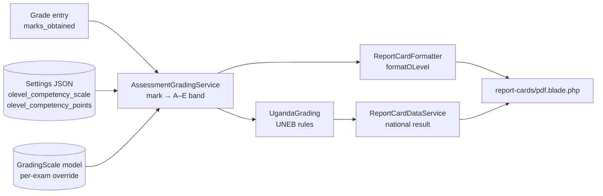

# O-Level (UCE) Grading — Implementation Report

*mySchool (Laravel 12 Ugandan school ERP) — generated 2026-08-29*

## 1. Architecture Overview

## 2. Format Resolution (which student gets O-level grading)

File: `app/Services/AssessmentGradingService.php`

- `Exam.assessment_format` is `primary | o-level | a-level | null` (null/`auto` = auto).
- `resolveFormat()` — if the exam format is auto, it derives from the student's class via
  `formatForClass()`: class category `o_level` (S.1–S.4) → `'o-level'`. Falls back to the
  `report_card_format` setting, then `'primary'`.
- Every public entry point (`rangesForExam`, `resolveForExam`, `previewRangesForExam`) accepts an
  optional `SchoolClass` so mixed-level schools grade each student against the correct scale.

## 3. Band Boundaries (mark → A–E)

Priority order in `rangesForFormat()`:

1. **Per-exam `GradingScale`** (DB model with `ranges()` rows: grade/min/max/points/description) — overrides everything.
2. **`olevel_competency_scale` setting** — admin-editable JSON array of `{grade, min, max, points, description}`.
3. **Hardcoded defaults** (`defaultOLevelRanges()`):

| Grade | Marks %   | Points | Descriptor   |
|-------|-----------|--------|--------------|
| A     | 80–100    | 4      | Exceptional  |
| B     | 60–79.99  | 3      | Outstanding  |
| C     | 50–59.99  | 2      | Satisfactory |
| D     | 40–49.99  | 1      | Basic        |
| E     | 0–39.99   | 0      | Elementary   |

> **Corrected 2026-08-29** to the confirmed Bugambe SS model (reverse-engineered from a real
> report card): points were previously INVERTED (A=1..E=5) and B/C/D/E boundaries shifted.
> Higher points = better. Migration `2026_08_29_000001` fixes stale settings rows and
> re-bands historical grade letters.

- Descriptors are the **official UNEB/NCDC wording** (fix A4 — replaced the old
  Excellent/Very Good/... labels).
- `resolve()` walks ranges sorted by `min` descending; the lowest-band fallback applies to
  out-of-range NUMERIC input only. A **null/missing mark short-circuits via `resolveMark()`
  to an explicit NOT YET ASSESSED** state before banding ever runs — it can never print as E.

## 4. UNEB Rules Layer

File: `app/Services/UgandaGrading.php`

### New CBC competency path

- `oLevelCompetencyLevel($marks)` — delegates to `AssessmentGradingService::rangesForFormat('o-level')`,
  so it reads the **same configurable source** as report rendering.
- `oLevelCompetencyPoints($level)` — A=4…E=0 by default, overridable via `olevel_competency_points`
  JSON setting.
- `oLevelSubjectResult($marks)` — bundles `{level, points, description}`.
- `oLevelOverallLevel($averagePercentage)` — now takes the average PERCENTAGE and delegates to
  the same band resolution as each subject — the old points-based thresholds could disagree
  with the report summary (§3 fix).

### Legacy aggregate path (HISTORICAL ONLY — pre-CBC records)

- `uceAggregate()` / `uceDivision()` survive for genuinely old records but **no longer feed
  current S.4 labels**: `nationalResult('UCE', ...)` now returns the competency-based
  "Achievement Level X — Descriptor" with `aggregate = null` (§4 fix). Stanine conversion is
  PLE-only.

## 5. Report Card Rendering

File: `app/Services/ReportCardFormatter.php` — `formatOLevel()` (dispatched when resolved format is `'o-level'`):

- Per subject: raw marks → `resolve()` → grade, points, descriptor, badge color (`getOLevelGradeColor()`).
- **Composite exams**: if a grade row carries `components` (from `ReportCardCompositionService` —
  e.g. coursework + final weighted via the `exam_report_components` pivot), each component is
  graded separately and shown as a breakdown.
- Summary: `total_points` (sum), `average_points`, `overall_grade`/`overall_descriptor`
  (resolved from the average **percentage**, not average points), position/class size
  (competition ranking with ties 1,2,2,4 in `ReportCardDataService::computeFigures`).
- Output labelled "O-Level School Report (Competency-Based)"; PDF adds a grading-key legend from
  the same ranges, plus a QR verification code (`GET /verify/{code}`).

## 6. Supporting Pieces

- **Grade entry**: previews use `previewRangesForExam()` so teachers see the band live; saves are
  blocked (HTTP 423) unless exam status is `marks_entry_open`
  (workflow: draft → marks_entry_open → locked → published).
- **Subject components** (papers): `subject_components` table + `grades.subject_component_id`;
  `ComponentMarksService` and `ReportCardCompositionService::combineSubjectRows()` merge paper
  rows before grading.
- **Settings UI**: scales are admin-editable JSON in Settings; no code change needed for
  circular updates.
- Note: the `ExamCycle` / `PaperResult` / `CombinationRule` / `PaperBandBoundary` machinery is
  **UACE (A-level) only**, not UCE.

## 7. Activity/CA Layer (built 2026-08-29 — the Bugambe mechanic)

- **`activity_scores` table**: per-activity raw scores (Activities of Integration) keyed by
  enrollment + subject + exam + activity_number. Blank slots = absent rows, excluded from the
  average — never zeros. Save-time cap at `activity_max_score`.
- **`grades` extensions**: `eot_raw_score`, `eot_max_score` (default 80),
  `eot_status` (scored|absent|withheld), `identifier` (teacher-entered 1/2/3, NEVER derived),
  `project_score_raw/max/status` (own grade, never merged into the final mark).
- **Settings**: `activity_scale_config` (`{"activity_max_score":3}`) and `ca_weight_config`
  (`{"ca":20,"eot":80}`, must sum to 100) — same admin-JSON mechanism as the scales.
- **`AssessmentGradingService::computeOLevelFinalMark()`** — the single O-Level grading path:
  `ca_mark = (activity_avg / activity_max) × ca_weight`; `final = ca_mark + EOT`; returns
  graded | incomplete | not_yet_assessed with all intermediates. Legacy single-mark rows are
  handled inside the same method.
- **Total Points**: only resolved subjects count; denominator printed inline as
  `points / (resolved subjects × 4)` — never a fixed constant.
- **Entry UI**: `grades/partials/olevel-entry.blade.php` — A1..An columns (+1 spare), Ident
  select, EOT score/status, Project score (/10 default); final mark computed on save, never typed.
  **Shared** by the admin Grades screen and the teacher portal (parameterized `$action`), both
  saving through `OLevelMarksService::save()` — one persistence path, no drift.
- **Project work**: own score (`project_score_raw` / `project_score_max`, default 10 via
  `activity_scale_config.project_max_score`) and own grade — NEVER merged into the subject's
  final mark. Printed as a separate "Project Work" section on the report/PDF.

## 8. Remaining Gaps

- **Custom scale boundaries are respected by policy** (confirmed 2026-08-29): schools that
  deliberately customized `olevel_competency_scale` keep their boundaries; only stale defaults
  and inverted points were migrated. Force-aligning a school to the Bugambe boundaries is a
  one-line settings edit in the admin UI, not a code change.
